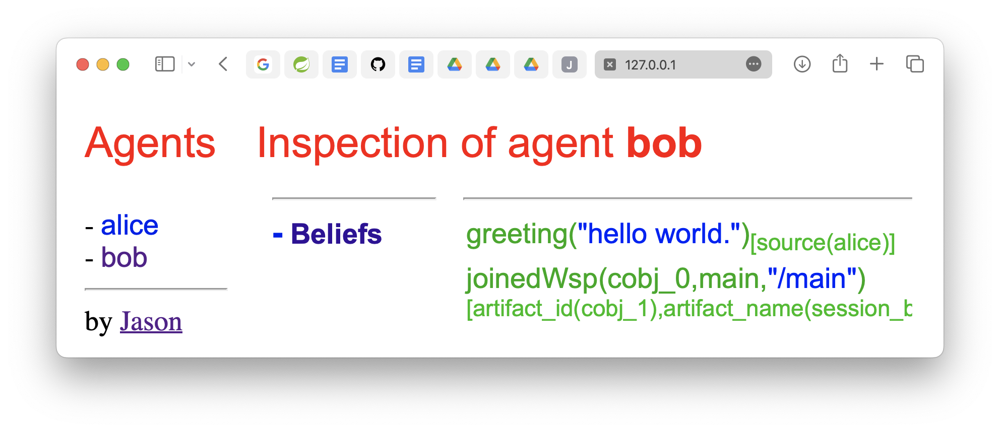

# Getting Started as a JaCaMo Application Developer
:toc: right
:author: JaCaMo Team
:date: February 2023
:source-highlighter: coderay
:coderay-linenums-mode: inline
:icons: font
:prewrap!:

This guide walks you through the process of creating a Multi-Agent application using JaCaMo platform.

= What You Will Build

You will build a very simple Multi-Agent System composed of two agents that exchange simple messages. These agents are named Bob and Alice. In the application, Alice sends a hello message to Bob.

NOTE: As a getting  started, the environment and organisation dimensions of JaCaMo will not be explored here. 

= What You Need

* Java 17 or newer
* A shell terminal
* A text editor

= Creating an initial application

ifdef::env-github[:outfilesuffix: .adoc]

The following commands will create a new JaCaMo application with some initial code for agents,  environment and organisation. (The first time you run JaCaMo takes longer since it downloads all dependencies.)

Unix::
+
----------------
curl -LO http://jacamo.sourceforge.net/nps/np1.1.zip
unzip np1.1.zip
./gradlew --console=plain -Dexec.args="--console"
----------------

Windows::
1. Download http://jacamo.sourceforge.net/nps/np1.1.zip
2. Unzip
3. Run `gradlew.bat`

//https://curl.haxx.se[`curl`] is a program that simply downloads the `np07.zip` file from http://jacamo.sourceforge.net/nps/np07.zip.

You will be asked to give an identification for the application, here we will use `my1st-app`.

Example of output:
----
> Task :run
JaCaMo 1.1 built on Wed Apr 06 19:16:53 BRT 2022

Enter the identification of the new application: my1st-app

You can run your application with:
   cd my1st-app
   ./gradlew -q --console=plain
----

Several files and folders were created, the most relevant are:

----
├── my1st_app.jcm      // JaCaMo application file
├── build.gradle       // Gradle script to run the application
├── logging.properties // Logging configuration
└── src
    ├── agt            // Code for agents
    │   └── sample_agent.asl
    ├── env            // Code for environment
    │   └── tools
    │       └── Counter.java
    └── org            // Code for organisation
        └── org.xml

----

= Execution

The application is ready to be executed with the command `./gradlew -q --console=plain` producing the following output:

----
CArtAgO Http Server running on http://127.0.0.1:3273
Jason Http Server running on http://127.0.0.1:3272
[sample_agent] hello world.
----

As you can see, an agent named `sample_agent` has printed a "Hello World" message.

= Creating agents Alice and Bob

So, you will now remove this `sample_agent` from the application and add Alice and Bob.  

The file `my1st_app.jcm` contains the list of initial agents of the MAS. Edit this file so that is looks as follows:

[source,jacamoproject,linenums]
.my1st_app.jcm
----
mas my1st_app {

    agent alice
    agent bob

}
----

The program of these agents are in files `alice.asl` and `bob.asl`, usually placed in the folder  `src/agt`. So create file `src/agt/alice.asl` as follows:

[source,jasonagent,linenums]
.alice.asl
----
!say_hello.  // initial goal

+!say_hello <-  // plan to achieve goal say_hello
    .send(bob,tell,greeting("hello world.")).
----

Briefly, this program states that Alice has one goal, created when she starts running. This goal can be achieved by a plan (in the two last lines) that simply sends a message to another agent named Bob telling him `greeting("hello world.")`.

NOTE: details about the language used to program the agents and the language used for their communication is covered in other documents. 

The program for Bob (file `src/agt/bob.asl`) is:

[source,jasonagent,linenums]
.bob.asl
----
+greeting(M)[source(A)] <-  // plan to react to new beliefs
    .print("I received ",M," from ",A).
----

Briefly, this plan states that as soon as he starts believing in a belief that matches `greeting(M)[source(A)]`, it prints out a message. This belief is added in his mind as the consequence of Alice's message. 

When you execute the application again, the output is:
----
[bob] I received hello world. from alice
----

As you can see at http://127.0.0.1:3272, Bob's belief is `greeting("hello world")[source(alice)]`. When his plan is executed, variable `M` is bound to  `"hello world"` and `A` to `alice`.

