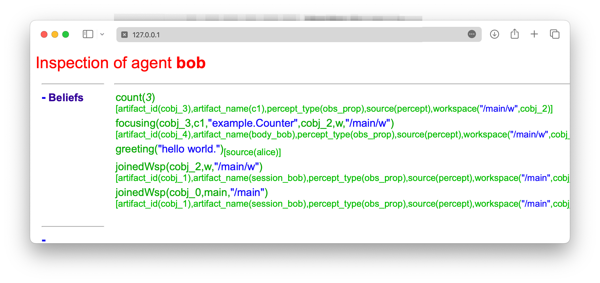
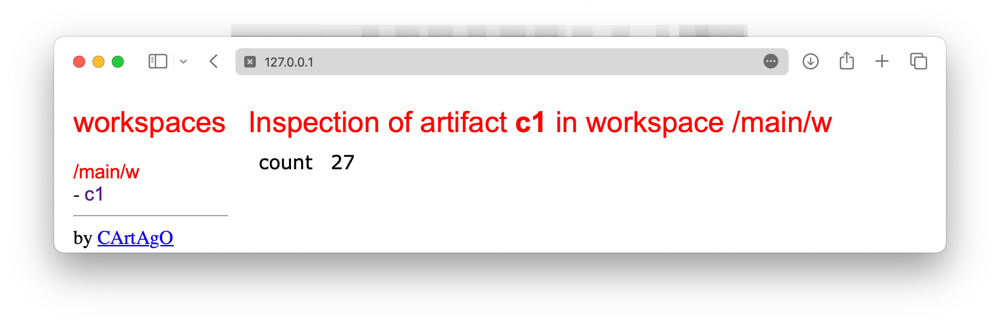

# Getting Started as a JaCaMo Application Developer
:toc: right
:author: JaCaMo Team
:date: February 2023
:source-highlighter: coderay
:coderay-linenums-mode: inline
:icons: font
:prewrap!:

This guide walks you through the process of creating a Multi-Agent application using JaCaMo platform.

= What You Will Build

You will build a very simple Multi-Agent System composed of two agents that exchange simple messages. These agents are named Bob and Alice. In the application, Alice sends a hello message to Bob, they are situated in the same environment and participate into an organisation. 

NOTE: As a getting started, the environment and organisation dimensions of JaCaMo will not be explored here. 

= What You Need

* Java 17 or newer
* A shell terminal
* A text editor (Visual Studio Code, Notepad, ...)

= Creating an initial application

ifdef::env-github[:outfilesuffix: .adoc]

The following commands will create a new JaCaMo application identified by `my1st-app` with some initial source code for agents,  environment and organisation. (The first time you run JaCaMo takes longer since it downloads all dependencies.)

Unix::
+
----------------
wget -q http://jacamo.sourceforge.net/nps/npss.zip
unzip -u npss.zip
./gradlew -Dexec.args="my1st-app --console"
----------------

Windows::
1. Download http://jacamo.sourceforge.net/nps/npss.zip
2. Unzip
3. Run `gradlew.bat`. When asked to give an identification, you should answer `my1st-app`.

// TODO: change version above to 1.2 when available

//https://curl.haxx.se[`curl`] is a program that simply downloads the `np07.zip` file from http://jacamo.sourceforge.net/nps/np07.zip.

Example of output:
----
Creating path ..../my1st-app

You can run your application with:
   cd .../my1st-app
   ./gradlew -q --console=plain
----

Several files and folders were created, the most relevant are:

----
├── my1st_app.jcm      // JaCaMo application file
├── build.gradle       // Gradle script to run the application
├── logging.properties // Logging configuration
└── src
    ├── agt            // Code for agents
    │   └── sample_agent.asl
    ├── env            // Code for environment
    │   └── example
    │       └── Counter.java
    ├── org            // Code for organisation
    │   └── org.xml
    └── test           // Code for testing
----

= Execution

The application is ready to be executed with the command `./gradlew -q --console=plain` producing the following output:

----
CArtAgO Http Server running on http://127.0.0.1:3273
Jason Http Server running on http://127.0.0.1:3272
[sample_agent] hello world.
----

As you can see, an agent named `sample_agent` has printed a "Hello World" message. The agent however keeps running, even without having nothing to do. To stop the execution,  you can press <CTRL>-C. 

= Creating agents Alice and Bob

So, you will now remove this `sample_agent` from the application and add Alice and Bob.  

The file `my1st_app.jcm` contains the list of initial agents of the MAS. Edit this file so that is looks as follows:

[source,jacamoproject,linenums]
.my1st_app.jcm
----
mas my1st_app {

    agent alice
    agent bob

}
----

The source codes of these agents are expected to be in the files `alice.asl` and `bob.asl` placed in the folder `src/agt`. So, create the file `src/agt/alice.asl` as follows:

[source,jasonagent,linenums]
.alice.asl
----
!say_hello.   // initial goal

+!say_hello   // plan to achieve goal say_hello
   <- .send(bob,tell,greeting("hello world")).

// some usual includes for JaCaMo projects:
{ include("$jacamoJar/templates/common-cartago.asl") }
{ include("$jacamoJar/templates/common-moise.asl") }
{ include("$moiseJar/asl/org-obedient.asl") }
----

This code states that Alice has one goal, created when she starts running. This goal can be achieved by a plan (3rd and 4th lines) that simply sends a message to another agent named Bob telling him `greeting("hello world")`.

NOTE: details about the language used to code the agents and the language used for their communication is covered in other documents. 

The source code for Bob (file `src/agt/bob.asl`) is:

[source,jasonagent,linenums]
.bob.asl
----
+greeting(M)[source(A)] <-  // plan to react to new beliefs
    .print("I received ",M," from ",A).

// some usual includes for JaCaMo projects:
{ include("$jacamoJar/templates/common-cartago.asl") }
{ include("$jacamoJar/templates/common-moise.asl") }
{ include("$moiseJar/asl/org-obedient.asl") }
----

This plan states that as soon as Bob has a belief that matches greeting(M)[source(A)], it prints out a message. This belief is added in his mind as the consequence of receiving Alice's message. 

Execute the application again with the command `./gradlew -q --console=plain` and now the output is:
----
[bob] I received hello world from alice
----

As you can see in the _Mind Inspector_ (at http://127.0.0.1:3272), Bob's belief is `greeting("hello world")[source(alice)]`. When his plan is executed, variable `M` is bound to  `"hello world"` and `A` to `alice`.

It follows also a screenshot of the project execution when using  Visual Studio Code as the IDE.

= Sharing an environment

The environment provides perception for the agents and is where their actions take place. In our application, agents will share an artifact of the environment to get unique identifiers. This kind of artifact is already included in the initial project.  It  is in file `src/env/tools/Counter.java`, so you do not need  to implement it. We will focus thus on how agents use it.

First, you need to set up our MAS environment with an instance of the counter artifact. Second, our agents should "look" at this artifact. These set up can be done changing the application file:

[source,jacamoproject,linenums]
.my1st_app.jcm
----
mas my1st_app {

  agent alice {
    focus: w.c1 
  }
  agent bob {
    focus: w.c1 
  }

  workspace w { 
    // create a counter artifact named c1 with  initial value = 3
    artifact c1: example.Counter(3) 
  } 
}
----

Note that both agents are focusing on the same artifact (identified by `c1` in workspace `w`). This artifact provides a `count` perception to the agents, which is stored in their belief base. You can notice that by running the application and taking a look at the mind inspector:

Now you can also inspect the environment state at http://127.0.0.1:3273:

The artifact also provides two actions: `inc` and `inc_get`. The latter increments the counter and returns the new value. Let's change Alice's source code to perform this action to continually increment the counter:

[source,jasonagent,linenums]
.alice.asl
----
// initial goals
!say_hello.     
!count.                              // *** new goal

// plan to achieve goal say_hello
+!say_hello
   <- .send(bob,tell,greeting("hello world")).

// plan to achieve goal count        // ** new plan
+!count 
   <- inc_get(1,NewValue);           // ** acting on the environment
      .print("I've got the unique value of ",NewValue);
      .wait(1000);
      !count. // continue counting

// some usual includes for JaCaMo projects:
{ include("$jacamoJar/templates/common-cartago.asl") }
{ include("$jacamoJar/templates/common-moise.asl") }
{ include("$moiseJar/asl/org-obedient.asl") }
----

Now, we will code Bob to also increment the counter continuously. Bob uses `inc` instead of `inc_get`, that has no parameter: it increments the counter by 1. Since changes in the counter produces changes in the belief `count`, Bob reacts to this changes printing the new perceived  value:

[source,jasonagent,linenums]
.bob.asl
----
// *** initial goal
!count. 

// plan to react to new beliefs
+greeting(M)[source(A)]
   <- .print("I received ",M," from ",A).

// *** plan to achieve goal count
+!count 
   <- inc;          // act on the  environment
      .wait(2000);  // wait a bit and
      !count.       // keep counting

// *** plan to react to changes in belief count
+count(X)
   <- .print("counter = ",X).

// some usual includes for JaCaMo projects:
{ include("$jacamoJar/templates/common-cartago.asl") }
{ include("$jacamoJar/templates/common-moise.asl") }
{ include("$moiseJar/asl/org-obedient.asl") }
----

So both agents are incrementing the value of a shared counter. Alice is getting unique values (for purposes not considered here) and Bob is just printing the values as he perceives them:

----
[bob] counter = 3
[alice] I've got the unique value of 4
[bob] counter = 4
[bob] I received hello world from alice
[bob] counter = 5
[alice] I've got the unique value of 5
[bob] counter = 6
[alice] I've got the unique value of 6
[bob] counter = 7
[alice] I've got the unique value of 7
[bob] counter = 8
[alice] I've got the unique value of 8
[bob] counter = 9
[alice] I've got the unique value of 9
[alice] I've got the unique value of 10
[bob] counter = 10
[alice] I've got the unique value of 11
[bob] counter = 11
[alice] I've got the unique value of 12
[bob] counter = 12
[alice] I've got the unique value of 13
[bob] counter = 13
[bob] counter = 14
[alice] I've got the unique value of 14
[alice] I've got the unique value of 15
[bob] counter = 15
[bob] counter = 16
[alice] I've got the unique value of 16
----

= Playing roles

Regarding the organisation dimension of our application, in this getting started, we will simply assign roles to agents. A role is a kind of "place holder" for agents in groups. We will create a group that Alice and Bob will join with roles `role1` and `role2`, respectively. 

All possible groups and roles of an organisation should be specified in an XML file. Here we will use the specification that is already included in the initial project (file `src/org/org.xml`). This specification defines a group type identified by `group1` and the two mentioned roles for this group. To create an instance of this group and assign its roles to our agents, you can change the application  project to:

[source,jacamoproject,linenums]
.my1st_app.jcm
----
mas my1st_app {

  agent alice {
    focus: w.c1 
    roles: role1 in my_group
  }
  agent bob {
    focus: w.c1 
    roles: role2 in my_group
  }

  workspace w {
    artifact c1: example.Counter(3) 
  }

  organisation o1 : org.xml {
    // create a group instance identified by my_group
    group my_group: group1
  } 
}

----
Now you can run the application and inspect the organisation state at http://127.0.0.1:3271:

The organisation provides several information for the agents to consider:

For the agent programming, we will change Alice's source code so that instead of sending a message to an agent named Bob, she sends a message to an agent playing `role2`:

[source,jasonagent,linenums]
.alice.asl
----
// new plan to achieve say_hello
+!say_hello
   <- .wait(play(Ag,role2,_)); // waits for a belief play/3 with the second term equals role2. 
                               // Ag is bound to the name of the agent playing role2
      .send(Ag,tell,greeting("hello world")).
----

Using this implementation, Alice's code is not tightly coupled with Bob anymore. Another agent can replace Bob as the player of `role2` and Alice keeps running correctly. 